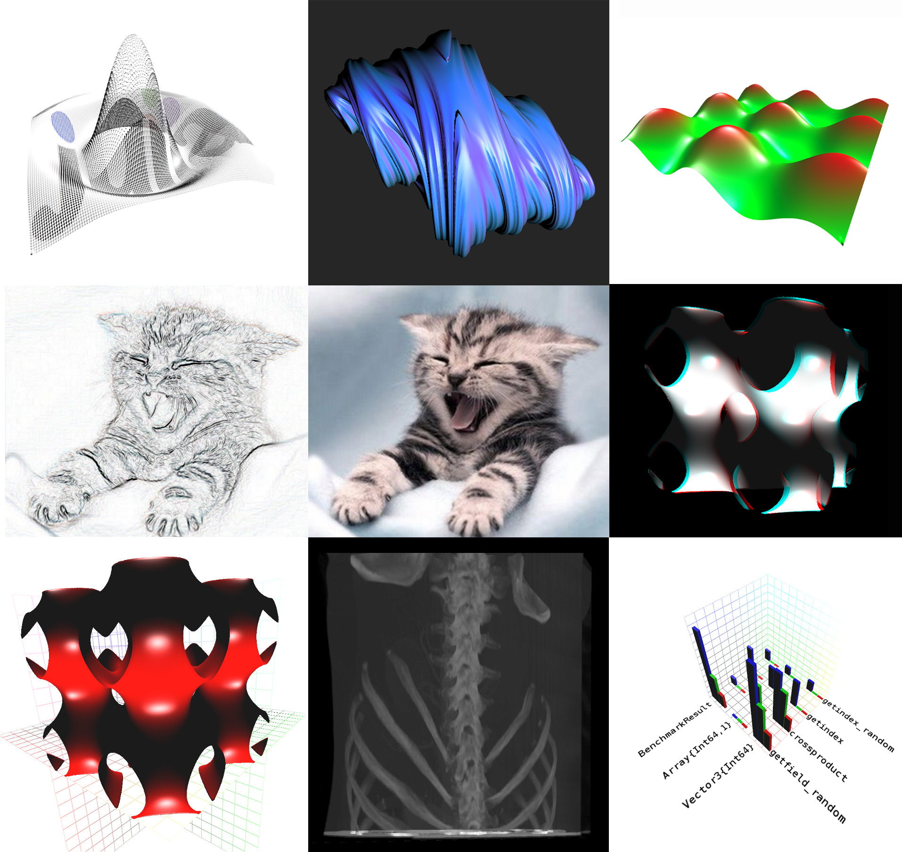

# GLPlot
#### Master is now using GLVisualize for rendering

If you want to discuss anything just open an issue or join the chat via gitter.
[](https://gitter.im/SimonDanisch/GLPlot.jl?utm_source=badge&utm_medium=badge&utm_campaign=pr-badge&utm_content=badge)



Everything is in the wiki now:
https://github.com/SimonDanisch/GLPlot.jl/wiki

Please read about the installation process:
Installation of master is a little tricky, but not overly complicated if you execute this script:
```Julia

Pkg.clone("https://github.com/JuliaIO/FileIO.jl.git")
Pkg.checkout("FileIO", "sd/improvements")
Pkg.clone("https://github.com/JuliaIO/MeshIO.jl.git")
Pkg.clone("https://github.com/JuliaGeometry/Packing.jl.git")
Pkg.clone("https://github.com/JuliaIO/ImageMagick.jl.git")
Pkg.build("ImageMagick")
Pkg.clone("https://github.com/JuliaGL/GLVisualize.jl.git")
Pkg.checkout("Images", "sd/fileio")

Pkg.checkout("GeometryTypes")
Pkg.checkout("FixedSizeArrays")
Pkg.checkout("Meshes", "ntuples")
Pkg.checkout("ModernGL")
Pkg.checkout("GLWindow")
Pkg.checkout("GLAbstraction")
Pkg.clone("https://github.com/SimonDanisch/GLPlot.jl.git")

```
